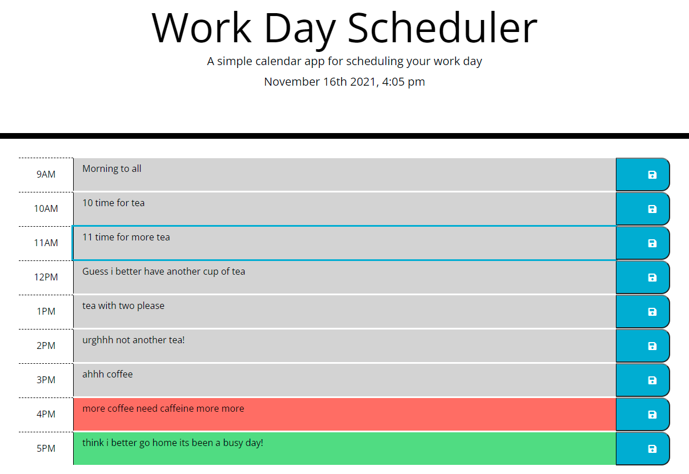

# ScheduleMe
**A Day Planner**
[ScheduleMe](https://daveydavey1901.github.io/ScheduleMe/)
Description
This weeks homework is to create a simple calendar application.
it has to:-
1. It should allow a user to save events for each hour of the day by modifying starter code.
2. This app will run in the browser and feature dynamically updated HTML and CSS powered by jQuery.
3. It will use Moment.js for the time and display it on the planner with the current date.
4. each time block is colour coded depending on if it is past, present or future.
5. The data can be saved to the local storage and will be persistant i.e will stay in the form until the local storage resets.

This task wasn't to difficult once you looked at the example as well as the provided code.  12 columns seems to be a standard so made things simple 1, 10 , 1... then just looking at the css provided was easy enough to see where they should be applied in the html... i watched through the [jquery for dummies]( https://www.youtube.com/playlist?list=PLillGF-RfqbYJVXBgZ_nA7FTAAEpp_IAc) which really came in handy as it covers a lot of whats needed for this.  

The date and time was simple enough with [Moment.js](https://momentjs.com/) i can see from this site just how handy this site or similar sites that deal with time can be. after doing a lot of reading recently on this and this and this it made sense to use this a lot in this...
the real difficulty i had was with the local storage again... i reviwed my code from a previous bit of home work buidling a code quiz and adapted it for this. as well as looking through a lot of MDN, W3Schools and my coding for dummies books.

everything seems to work as expected.

Visuals
|image of the completed planner which matches the example img|
|------------------------------------------------------------|
|              |

**future**
i may look into doing similar things but with a lot more content and options.. this was just a nice task to do.
